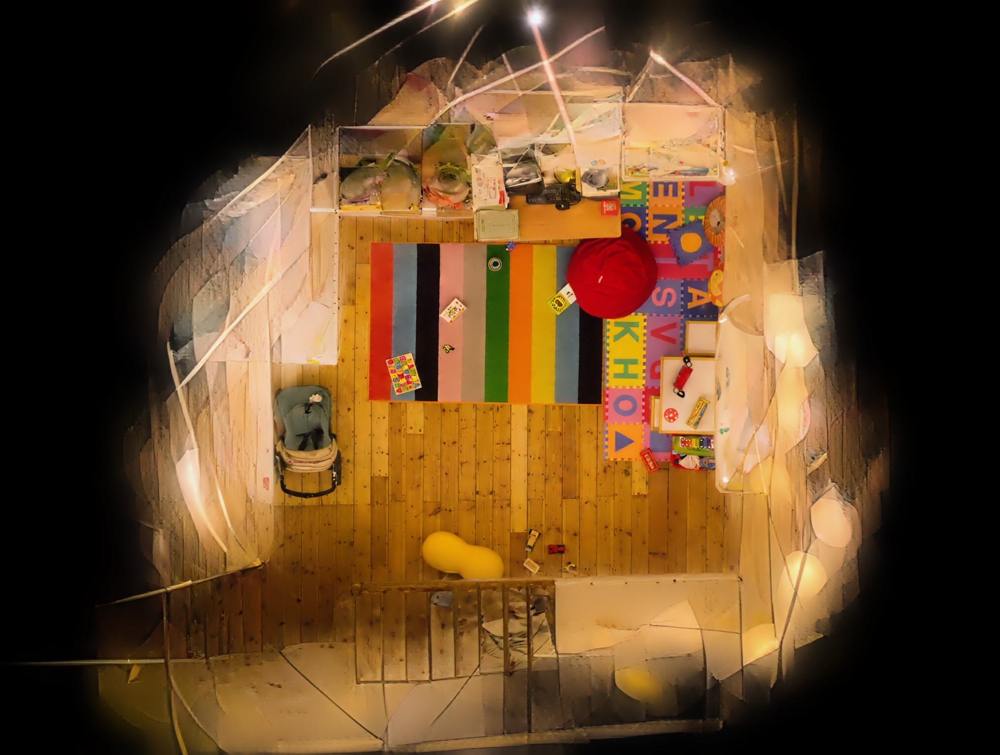
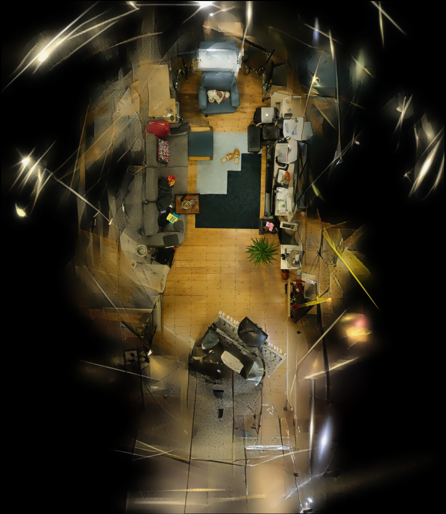
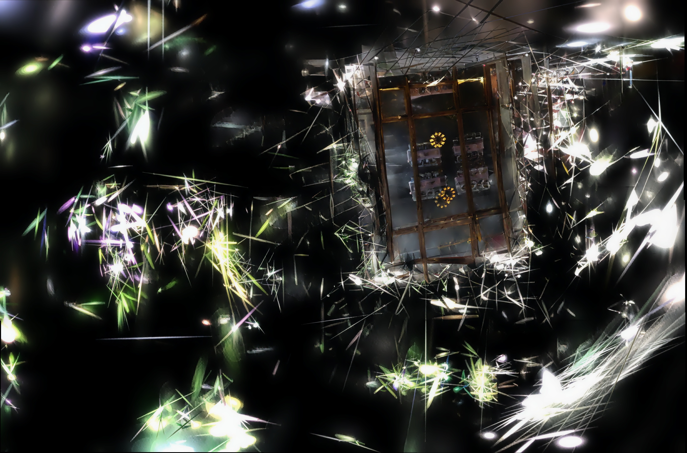
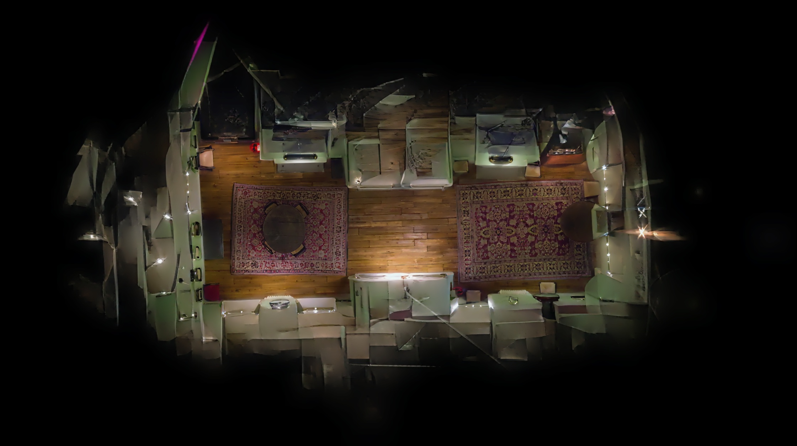

# Torthosplatting / 正射高斯

> 室内正射影像自动生成工具 — 手机拍房间，一键出平面图。

[English README](README.md)

---

## 这是什么？

用手机或相机围绕房间拍摄一段视频或一组照片，交给 **Torthosplatting**，自动生成一张从正上方俯瞰的房间平面正射图。适用于**室内设计参考、租房看房展示、房产户型记录**。

## 工作流程

```
手机拍照
    ↓
COLMAP 稀疏重建 (sparse/0)
    ↓
坐标系自动对齐 ──→ 虚拟正射相机生成
    ↓
单目深度估计 (DepthAnythingV2)
    ↓
3DGS 训练(透视) + 正射渲染(正交)
    ↓
Difix 扩散修复
    ↓
SIFT 拼接 ──→ 房间正射平面图
```

## 效果展示 / Results

| playroom | room |
|----------|------|
|  |  |

| Meetingroom | drjohnson |
|-------------|-----------|
|  |  |

## 快速开始

### 环境要求

- Linux, CUDA 11.8, NVIDIA GPU (24GB 推荐)
- Python 3.8, PyTorch 2.0, Conda

### 安装

```bash
git clone https://github.com/hjh530/Torthosplatting.git
cd Torthosplatting

# 1. 创建环境
conda env create -f environment.yml
conda activate Torthosplatting

# 2. 下载模型权重
# DepthAnythingV2: https://huggingface.co/spaces/LiheYoung/Depth-Anything-V2
# 放入 checkpoints/depth_anything_v2_vitl.pth

# 3. 编译 CUDA 模块
export CUDA_HOME=/usr/local/cuda-11.8
cd submodules/diff-gaussian-rasterization && pip install -e . && cd ../..
cd submodules/diff-gaussian-rasterization-ortho && pip install -e . && cd ../..
cd submodules/simple-knn && pip install -e . && cd ../..

# 4. 额外依赖
pip install xformers==0.0.22 --no-deps
pip install triton==2.0.0
```

### 运行

```bash
./run_pipeline.sh -d <数据名> -g 0
# 示例：
./run_pipeline.sh -d room1 -g 0
./run_pipeline.sh -d room1,room2 -g 0   # 多个
```

### 输入格式

```
数据目录/
├── sparse/0/          # COLMAP 稀疏重建 (BIN 或 TXT)
│   ├── cameras.bin
│   ├── images.bin
│   └── points3D.bin
└── images/            # 原始照片
```

### 输出

```
数据目录/ortho_output/
├── virtual_1_r1_c1.png   # 25 张修复后的正射瓦片
├── ...
└── ortho_stitched.jpg     # 最终拼接正射大图
```

## 技术方案

### 1. 从透视到正交：为什么改、怎么改

3DGS 将每个 3D 高斯椭球投影到 2D 图像平面。投影涉及两个数学组件：

1. **投影矩阵** $P$（Python 层）：将相机坐标 $(x_c, y_c, z_c)$ 映射到裁剪空间
2. **协方差雅可比** $J$（CUDA 层）：将 3D 协方差矩阵 $\Sigma_{3D}$ 投影到 2D 屏幕空间 $\Sigma_{2D}$

训练和渲染的投影关系：

| 阶段 | 投影 | CUDA 模块 | 原因 |
|------|------|----------|------|
| 训练 | 透视 | 3DGS | 必须匹配输入照片（pinhole/simple pinhole） |
| 渲染 | 正交 | Tortho | 俯视平面图需要平行投影 |

#### 1.1 透视投影（训练）

标准针孔相机将 3D 点 $(X, Y, Z)$ 映射到像素 $(u, v)$：

$$u = f_x \cdot \frac{X}{Z} + c_x, \quad v = f_y \cdot \frac{Y}{Z} + c_y$$

其中 $f_x, f_y$ 为像素焦距，$c_x, c_y$ 为主点。关键观察：坐标被 **深度 $Z$ 除** — 远处物体更小。

OpenGL 风格的透视投影矩阵 $P_{persp}$：

$$P_{persp} = \begin{bmatrix}
\frac{2n}{r-l} & 0 & \frac{r+l}{r-l} & 0 \\
0 & \frac{2n}{t-b} & \frac{t+b}{t-b} & 0 \\
0 & 0 & \frac{f}{f-n} & -\frac{fn}{f-n} \\
0 & 0 & 1 & 0
\end{bmatrix}$$

其中 $n, f$ = 近/远平面，$l, r, b, t$ = $z=n$ 处的视锥体边界。

**代码**（`utils/graphics_utils.py`）：

```python
# 透视：视锥体 — znear 决定缩放
tanHalfFovY = math.tan(fovY / 2)
tanHalfFovX = math.tan(fovX / 2)
top = tanHalfFovY * znear    # ← 与 znear 成正比
right = tanHalfFovX * znear  # ← 与 znear 成正比
P[0,0] = 2.0 * znear / (right - left)
P[1,1] = 2.0 * znear / (top - bottom)
```

#### 1.2 正交投影（渲染）

正交投影丢弃深度依赖的缩放。3D 点映射为：

$$u = f_x \cdot X + c_x, \quad v = f_y \cdot Y + c_y$$

不除以 $Z$。所有深度的物体等大 — 正是平面图需要的效果。

正交投影矩阵 $P_{ortho}$：

$$P_{ortho} = \begin{bmatrix}
\frac{2}{r-l} & 0 & 0 & -\frac{r+l}{r-l} \\
0 & \frac{2}{t-b} & 0 & -\frac{t+b}{t-b} \\
0 & 0 & -\frac{2}{f-n} & -\frac{f+n}{f-n} \\
0 & 0 & 0 & 1
\end{bmatrix}$$

与 $P_{persp}$ 的关键区别：
- **$P[0,0]$ 和 $P[1,1]$ 不含 $n$**：缩放与深度无关
- **$P[0,3]$、$P[1,3]$ 替代 $P[0,2]$、$P[1,2]$**：XY 平移而非透视偏移
- **$P[3,2]=0$** 而非 $1$：齐次坐标中无透视除法

**代码**：

```python
# 正交：固定视口，无 znear
top = 5                    # 固定视口高度
right = tanHalfFovX * 5 / tanHalfFovY  # 保持宽高比
P[0,0] = 2.0 / (right - left)      # 无 znear → 所有深度同缩放
P[0,3] = -(right + left) / (right - left)  # XY 平移
return (right-left)/2, (top-bottom)/2, P  # 返回半尺寸给渲染器
```

#### 1.3 为什么雅可比也必须改变

3D 高斯协方差 $\Sigma_{3D}$ 投影到 2D 屏幕空间：

$$\Sigma_{2D} = J \cdot W \cdot \Sigma_{3D} \cdot W^T \cdot J^T$$

其中 $W$ 是视图矩阵的旋转部分，$J$ 是**投影雅可比** — 屏幕坐标对相机坐标的导数：

$$J = \begin{bmatrix}
\frac{\partial u}{\partial X} & \frac{\partial u}{\partial Y} & \frac{\partial u}{\partial Z} \\
\frac{\partial v}{\partial X} & \frac{\partial v}{\partial Y} & \frac{\partial v}{\partial Z}
\end{bmatrix}$$

**透视**投影（$u = f_x \cdot X/Z$，$v = f_y \cdot Y/Z$）：

$$J_{persp} = \begin{bmatrix}
\frac{f_x}{Z} & 0 & -\frac{f_x \cdot X}{Z^2} \\
0 & \frac{f_y}{Z} & -\frac{f_y \cdot Y}{Z^2}
\end{bmatrix}$$

$-\frac{f \cdot X}{Z^2}$ 项是**泰勒展开修正**：高斯体侧移 $\Delta X$ 时，其深度 $Z$ 会改变屏幕位置。

**正交**投影（$u = f_x \cdot X$，$v = f_y \cdot Y$）：

$$J_{ortho} = \begin{bmatrix}
f_x & 0 & 0 \\
0 & f_y & 0
\end{bmatrix}$$

无 $1/Z$ 缩放，无泰勒修正 — 导数是常数。

**CUDA 中**（`forward.cu`）：

```c
if (orthographic) {
    J = glm::mat3(focal_x, 0, 0,  0, focal_y, 0,  0, 0, 0);
} else {
    J = glm::mat3(
        focal_x / t.z, 0, -(focal_x * t.x) / (t.z * t.z),
        0, focal_y / t.z, -(focal_y * t.y) / (t.z * t.z),
        0, 0, 0);
}
```

#### 1.4 为什么不用正交来训练？

训练必须使用透视投影，因为输入照片本身就是透视投影。如果用正交训练，优化器会得到错误梯度——模型试图用正交渲染器拟合透视图像，产生畸变的几何。保持训练用透视，模型从输入照片学习正确的 3D 结构，只在最终渲染时切换正交。

### 2. 坐标系转换与虚拟位姿生成

COLMAP 重建输出的是任意坐标系——地面可能倾斜，墙壁可能旋转。`utils/gen_virtual_cams.py` 将其标准化并生成正射虚拟相机。

#### 2.1 两步对齐

设 $P_{orig}$ 为 COLMAP 坐标系中的点。目标是新坐标系满足：
- **Z 轴** $\uparrow$ = 地面法线（上方方向）
- **X、Y 轴** = 与房间墙壁对齐
- **原点** = 地面参考点 $P_{ground}$

$$P_{aligned} = A_2 \cdot A_1 \cdot (P_{orig} - P_{ground})$$

其中 $A_1$ 将地面法线对齐到 Z，$A_2$ 将墙壁对齐到 XY 轴。

#### 2.2 步骤1：地面对齐（$A_1$）

**RANSAC 平面拟合**：随机采样 3 点子集，计算平面法线，保留内点最多的：

$$\hat{n} = \arg\max_{n} |\{p_i : |n \cdot (p_i - p_0)| < \tau\}|$$

其中 $\tau = 0.02$ 为距离阈值。

**地面 vs 天花板判定**：临时将法线旋转到 Z，检查垂直分布：

$$\mathrm{span}_\mathrm{low} = P_{50}(z) - P_{10}(z), \quad \mathrm{span}_\mathrm{high} = P_{90}(z) - P_{50}(z)$$

若 $\mathrm{span}_\mathrm{low} \geq \mathrm{span}_\mathrm{high}$，拟合的平面是天花板 — 翻转 $n \leftarrow -n$。

**Rodrigues 旋转**将 $n$ 对齐到 $[0,0,1]$：

$$A_1 = I + [v]_\times + [v]_\times^2 \cdot \frac{1-c}{s^2}$$

其中 $v = n \times [0,0,1]$（旋转轴），$c = n \cdot [0,0,1]$（余弦），$s = \|v\|$（正弦），$[v]_\times$ 为叉积反对称矩阵。

#### 2.3 步骤2：墙壁对齐（$A_2$）

**XY 密度投影**：将已对齐点投影到 XY 平面，用 k-NN 距离和 MAD 阈值做密度离群滤波：

$$\mathrm{keep}(p_i) = \mathrm{knn\_dist}(p_i) \leq \min(P_{97}(\mathrm{knn\_dist}), \mathrm{median} + 4 \cdot \mathrm{MAD})$$

**Hough 线段检测**：栅格化投影点，Canny 边缘检测，概率 Hough 变换提取线段 $\{(\mathbf{p}_1, \mathbf{p}_2)\}$。

**边缘筛选**：仅保留靠近点云外轮廓的线段。

**正交方向搜索**：对每个候选角 $\theta \in [0°, 180°)$，计算对齐到 $\theta$ 和 $\theta + 90°$ 的线段总支持：

$$\mathrm{score}(\theta) = \sum_{\mathrm{seg } \approx \theta} \mathrm{length}(\mathrm{seg}) + \sum_{\mathrm{seg } \approx \theta+90°} \mathrm{length}(\mathrm{seg})$$

选择最大化得分的角度 $\theta^*$。

**旋转对齐**：$A_2 = R_z(-\theta^*)$，绕 Z 轴旋转：

$$A_2 = \begin{bmatrix}
\cos\theta^* & -\sin\theta^* & 0 \\
\sin\theta^* & \cos\theta^* & 0 \\
0 & 0 & 1
\end{bmatrix}$$

#### 2.4 步骤3：虚拟相机放置

对齐后场景有明确定义的 XY 包围盒。在 $5 \times 5$ 网格中放置 25 个虚拟相机：

$$\mathbf{C}_{ij} = \begin{bmatrix} x_{min} + (i+0.5) \cdot \frac{x_{max}-x_{min}}{5} \\ y_{min} + (j+0.5) \cdot \frac{y_{max}-y_{min}}{5} \\ 0.8 \cdot z_{max} \end{bmatrix}, \quad i,j \in \{0,1,2,3,4\}$$

每个相机朝下，旋转四元数 $\mathbf{q} = [0, 1, 0, 0]$（恒等旋转，在世界坐标中沿 $-Z$ 方向观察）。

相机外参：$\mathbf{t} = -R_{ortho} \cdot \mathbf{C}$。

```python
def getProjectionMatrix(znear, zfar, fovX, fovY, orthographic=False):
    if not orthographic:
        # 透视投影：视锥体近大远小
        tanHalfFovY = math.tan(fovY / 2)
        tanHalfFovX = math.tan(fovX / 2)
        top = tanHalfFovY * znear
        right = tanHalfFovX * znear
        P = torch.zeros(4, 4)
        P[0, 0] = 2.0 * znear / (right - left)   # 水平缩放
        P[0, 2] = (right + left) / (right - left) # 水平偏移
        P[1, 1] = 2.0 * znear / (top - bottom)   # 垂直缩放
        P[1, 2] = (top + bottom) / (top - bottom) # 垂直偏移
        P[2, 2] = zfar / (zfar - znear)           # 深度映射
        P[2, 3] = -(zfar * znear) / (zfar - znear)
        P[3, 2] = 1.0
        return P
    else:
        # 正交投影：无透视缩放，物体大小与距离无关
        tanHalfFovY = math.tan(fovY / 2)
        tanHalfFovX = math.tan(fovX / 2)
        top = 5          # 固定视口高度
        right = tanHalfFovX * 5 / tanHalfFovY  # 保持宽高比
        P = torch.zeros(4, 4)
        P[0, 0] = 2.0 / (right - left)        # X 缩放（不含 z）
        P[0, 3] = -(right + left) / (right - left)  # X 平移
        P[1, 1] = 2.0 / (top - bottom)        # Y 缩放（不含 z）
        P[1, 3] = -(top + bottom) / (top - bottom)  # Y 平移
        P[2, 2] = -2.0 / (zfar - znear)
        P[2, 3] = -(zfar + znear) / (zfar - znear)
        P[3, 3] = 1.0
        return (right - left) / 2, (top - bottom) / 2, P  # 视口半宽高
```

**关键差异**：透视投影中 `P[0,0]` 和 `P[1,1]` 分母含 `znear`（近平面距离），远处物体会缩小；正交投影中去掉了 `znear`，所有深度的物体等大。

#### 相机投影调用

`scene/cameras.py` — `Camera.get_full_proj_transform()` 在渲染时调用正交投影矩阵：

```python
class Camera(nn.Module):
    def __init__(self, ...):
        # 初始化时计算透视投影（训练用）
        self.projection_matrix = getProjectionMatrix(
            znear, zfar, FoVx, FoVy, orthographic=False
        ).transpose(0,1).cuda()
        self.full_proj_transform = (
            self.world_view_transform.unsqueeze(0)
            .bmm(self.projection_matrix.unsqueeze(0))
        ).squeeze(0)

    def get_full_proj_transform(self, orthographic=False):
        if not orthographic:
            return self.full_proj_transform  # 训练用
        else:
            # 渲染时重新计算正交投影
            tanfovx, tanfovy, proj_mat = getProjectionMatrix(
                znear, zfar, FoVx, FoVy, orthographic=True
            )
            full_proj = (
                self.world_view_transform.unsqueeze(0)
                .bmm(proj_mat.transpose(0,1).cuda().unsqueeze(0))
            ).squeeze(0)
            return tanfovx, tanfovy, full_proj  # 渲染用
```

#### CUDA 协方差雅可比

`forward.cu` — `computeCov2D()` 是唯一需要在正交和透视间切换的 CUDA 函数，它将 3D 协方差矩阵投影到 2D 屏幕空间：

```c
__device__ float3 computeCov2D(
    const float3& mean, float focal_x, float focal_y,
    float tan_fovx, float tan_fovy,
    const float* cov3D, const float* viewmatrix,
    const bool orthographic)
{
    float3 t = transformPoint4x3(mean, viewmatrix);
    glm::mat3 J;

    if (orthographic) {
        // 正交投影：focal 直接作为缩放因子，无透视除法
        J = glm::mat3(
            focal_x, 0.0f,    0,   // ∂u/∂x, ∂u/∂y, ∂u/∂z
            0.0f,    focal_y, 0,   // ∂v/∂x, ∂v/∂y, ∂v/∂z
            0,       0,       0);
    } else {
        // 透视投影：含 1/z 缩放 + 泰勒展开修正项
        const float limx = 1.3f * tan_fovx;
        const float limy = 1.3f * tan_fovy;
        const float txtz = t.x / t.z;
        const float tytz = t.y / t.z;
        t.x = min(limx, max(-limx, txtz)) * t.z;
        t.y = min(limy, max(-limy, tytz)) * t.z;

        J = glm::mat3(
            focal_x / t.z,  0.0f,          -(focal_x * t.x) / (t.z * t.z),
            0.0f,           focal_y / t.z, -(focal_y * t.y) / (t.z * t.z),
            0,              0,             0);
    }
}
```

**直观理解**：透视投影中，高斯体越远（t.z 越大），屏幕投影越小（除以 t.z）。正交投影无此效果，所有距离的高斯体等大。

### 2. 坐标系转换与虚拟位姿生成

`utils/gen_virtual_cams.py` 将 COLMAP 输出的任意坐标系转换为"地面水平、墙壁正交"的标准坐标系，并生成正射俯瞰所需的虚拟相机。

#### 整体变换流程

```
COLMAP 原始坐标系
    ↓
步骤1: RANSAC 拟合地面 → 法线旋转至 Z 轴 (矩阵 A1)
    ↓
步骤2: XY 投影 + Hough 线段 → 旋转墙面方向对齐 XY 轴 (矩阵 A2)
    ↓
最终变换: P' = A2 · A1 · (P - P_ground)
    ↓
在 XY 包围盒内 5×5 采样虚拟相机 → 正射渲染
```

#### 步骤1: 地面检测

```python
# RANSAC 平面拟合
normal, p0, inliers = ransac_plane(pts, iters=2000, thresh=0.02)

# 判定地面 vs 天花板
A1_temp = rotation_from_vector_to_z(normal)  # 法线→Z轴
pts_temp = (pts - p0) @ A1_temp.T
span_low = z50 - z10   # 低处点云跨度
span_high = z90 - z50  # 高处点云跨度
if span_low >= span_high:  # 低处跨度大 → 天花板
    normal = -normal       # 翻转法线
A1 = rotation_from_vector_to_z(normal)  # 最终地面→Z轴
```

`rotation_from_vector_to_z(n)` 使用 Rodrigues 旋转公式，计算将任意法线向量旋转至 `[0,0,1]` 的旋转矩阵。

#### 步骤2: 墙面方向检测

```python
def align_xy_by_outer_boundary_grid(points):
    # 1. 点云投影至 XY 平面
    projected_xy = points[:, :2]
    # 2. 密度滤波去除离群点
    projected_xy = density_filter_xy(projected_xy)
    # 3. 外轮廓提取
    boundary_pts = extract_outer_contour_xy(projected_xy)
    # 4. Hough 线段检测
    hough_segments = detect_hough_line_segments(projected_xy)
    # 5. 筛选边缘线段
    edge_segs = filter_by_boundary_proximity(hough_segments, boundary_pts)
    # 6. 正交方向估计（0-180° 搜索最佳正交对）
    best_angle = estimate_from_orthogonal_support(edge_segs)
    # 7. 旋转对齐
    A2 = rotation_matrix_z(-np.radians(best_angle))
    return A2
```

#### 步骤3: 虚拟相机生成

```python
q_ortho = np.array([0.0, 1.0, 0.0, 0.0])  # 竖直向下
R_ortho = qvec2rotmat(q_ortho)

for row in range(1, 6):
    for col in range(1, 6):
        C = centers[count - 1]
        t = -R_ortho @ C  # 平移向量
        images[img_id] = {
            "qvec": q_ortho, "tvec": t,
            "camera_id": ref_camera_id,
            "name": f"virtual_{count}_r{row}_c{col}.png",
        }
```

### 3. Tortho 对 DIFIX 的四处修改

| 文件 | 修改内容 |
|------|---------|
| `utils/graphics_utils.py` | `getProjectionMatrix()` 增加 `orthographic` 参数；正交分支返回 `(half_w, half_h, matrix)` 三元组 |
| `gaussian_renderer_ortho.py` | 新建独立正交渲染器，调用 Tortho CUDA 模块 |
| `scene/cameras.py` | `Camera` 增加 `get_full_proj_transform(orthographic)` 方法，运行时动态选择投影 |
| `forward.cu` | `computeCov2D()` 增加 `orthographic` 参数和正交雅可比分支 |

## 项目结构

```
Torthosplatting/
├── train.py                  # 3DGS 训练（透视）
├── render_ortho.py           # 正射渲染（正交）
├── restore.py                # Difix 图像修复
├── depth_gen.py              # 深度图生成
├── run_pipeline.sh           # 一键流水线
├── environment.yml           # Conda 环境
│
├── scene/                    # 3DGS 场景模块
├── gaussian_renderer/        # 透视渲染器（训练）
├── gaussian_renderer_ortho.py # 正交渲染器（渲染）
│
├── utils/
│   ├── gen_virtual_cams.py   # 虚拟相机生成 + 坐标系对齐
│   ├── calibrate_depth.py    # 深度尺度校准
│   ├── stitch_ortho.py       # 正射拼接
│   └── gen_dummy_images.py   # 虚拟占位图
│
├── submodules/
│   ├── diff-gaussian-rasterization/        # 训练 CUDA (DIFIX)
│   ├── diff-gaussian-rasterization-ortho/  # 渲染 CUDA (Tortho)
│   └── simple-knn/
│
├── depth_anything_v2/        # DepthAnythingV2
└── checkpoints/              # 模型权重
```

## 致谢

- **[3D Gaussian Splatting](https://github.com/graphdeco-inria/gaussian-splatting)** — 实时辐射场渲染
- **[DIFIX3D+](https://research.nvidia.com/labs/toronto-ai/difix3d/)** — 单步扩散模型修复 3D 重建 (CVPR 2025 Oral)
- **[DepthAnythingV2](https://github.com/DepthAnything/Depth-Anything-V2)** — 单目深度估计
- **[COLMAP](https://github.com/colmap/colmap)** — 稀疏重建

## License

学术研究用途。各组件遵循原始项目许可证。
